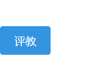

## 目录

- [背景](#背景)
- [安装](#安装)
- [用法](#用法)
- [相关项目（可选）](#相关项目)
- [主要项目负责人](#主要项目负责人)
- [贡献人员](#贡献人员)

## 背景

笔者在学期末例行评教时摸的一个小脚本,尽可用于大连理工大学目前的[学生评教](http://jxgl.dlut.edu.cn/evaluation-student-frontend/#/byTask)系统

## 安装

> 使用前请先在浏览器安装插件[油猴Tampermonkey](https://chrome.google.com/webstore/detail/tampermonkey/dhdgffkkebhmkfjojejmpbldmpobfkfo?utm_source=chrome-ntp-icon)
下载项目中的[自动评教.user.js](自动评教.user.js)文件并导入到油猴中，或在在[Greasy Fork](#)上安装

## 用法

由于笔者水平有限，使用了延时的加载等待，打开[学生评教](http://jxgl.dlut.edu.cn/evaluation-student-frontend/#/byTask)5s后会在左下角显示评教按钮，在具体教师页面点击即可自动完成评教（不会自动提交，以后可能会写）

## 相关项目

暂无

## 主要项目负责人

[@Nouchi](https://github.com/Nouchi-Kousu)

### 贡献人员

感谢所有贡献的人。

